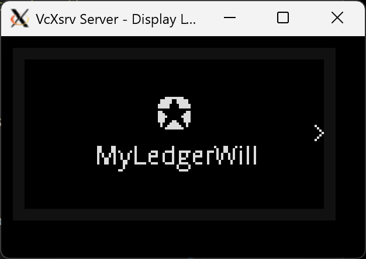
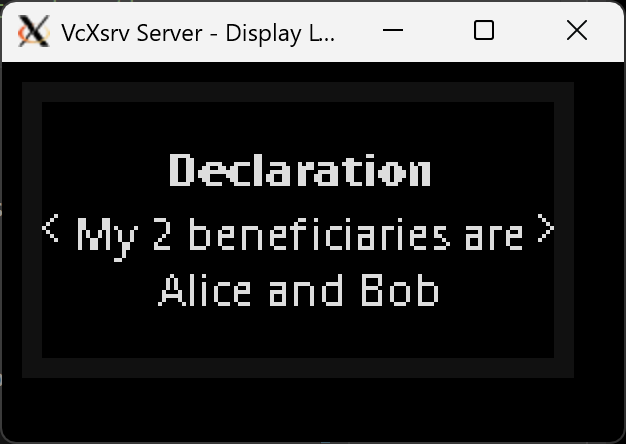
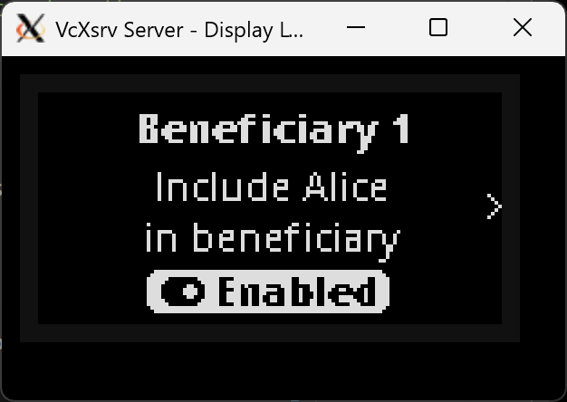
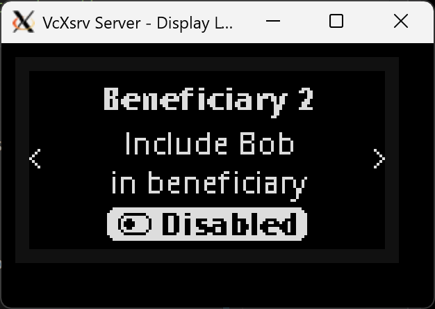
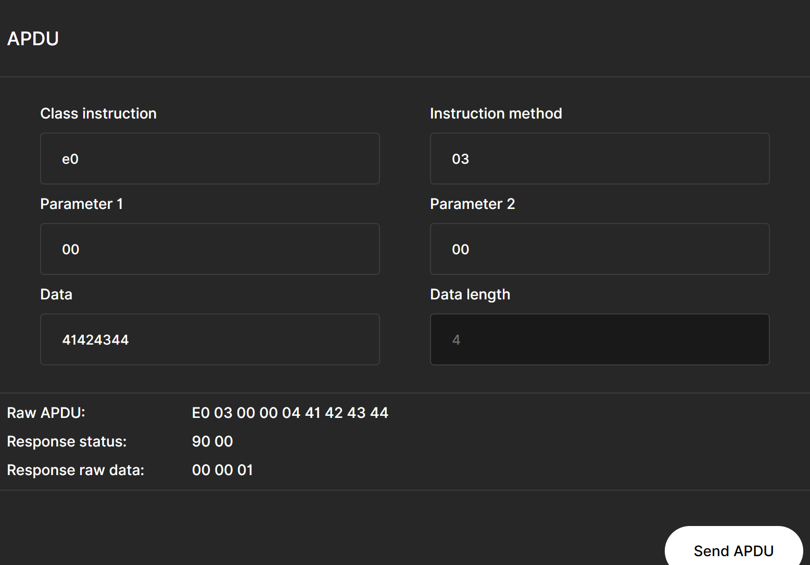

# MyLedgerWill

A standalone WILL application on ledger for the owner to manage how the assets are to be distributed during estate administration

## Problem Statement

The Ledger device is good for mainstream (non-web3 maxi) folks to use to protect their digital assets. However, the concern is that the legal community (aka lawyers) may not have caught up with how to manage such assets when administering the owner's estate. 

## Solution

A standalone WILL application embedded in the Ledger can allow the owner to define how/what/when the assets are to be distributed. This WILL app can keep up with the latest in Web3 developments in handling NFTs, Stable coins, RWAs, etc, while the estate administrator only needs to turn on the ledger (or plug the ledger into a power-bank) to get the details on how the assets are to be managed.

Features I expect in this WILL app include:

* Free-form AI assisted input with version control. The owner can start to enter a free-form AI assisted text entry on how the assets are to be distributed. Any changes to the text entry should be tracked similarly to version of WILLs
* Hardcoded beneficiaries. Besides manual entry to the ledger, the owner can choose to fix the beneficiaries so that they cannot be added/removed. This can be done by compiling the names/addresses of the beneficiaries into the app code. The owner then can change the percentage of allocation dynamically
* Auto-trigger. The WILL app can interface with the other wallets in the ledger to create the transactions to trigger the distribution. It will likely need to get inputs from a proof-of-life smartcontract for this to happen
  
  

## Work done so far

This is what I've implemented after some hours of hacking:

1) Changed the initial start screen
   

2) Included a Declaration page
   

3) Option to allocate assets dynamically
   
   

4) Allowing remote client to update the tagline
   Update the tagline to "ABCD" 
   

## Running in standalone mode in a Ledger

The app is loaded into a Nano S Plus and conneced to a powerbank to run. 

[Video]([V0.1 of MyLedgerWill running in a Nano S Plus - YouTube](https://youtube.com/shorts/Pg4ugIQ0iBs))

## Licenses

Users are free to extend on this idea as long as they attribute the origin of the idea to Teik Guan Tan @tanteikg

Copyright (c) Teik Guan Tan @tanteikg
